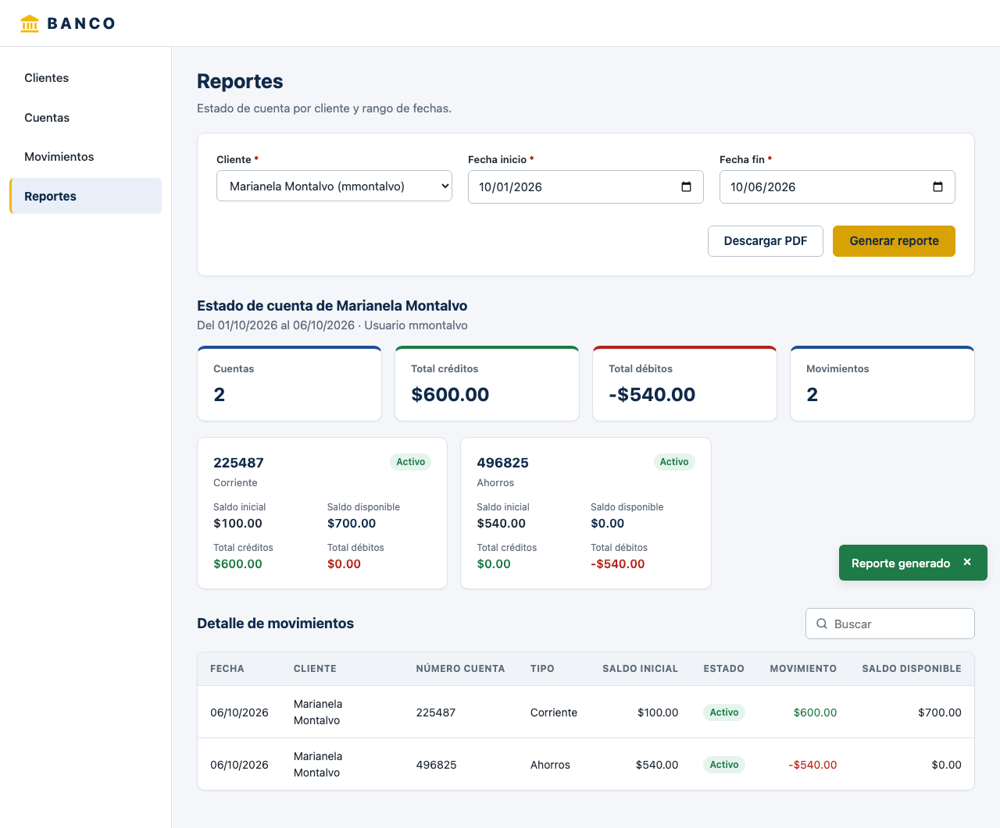
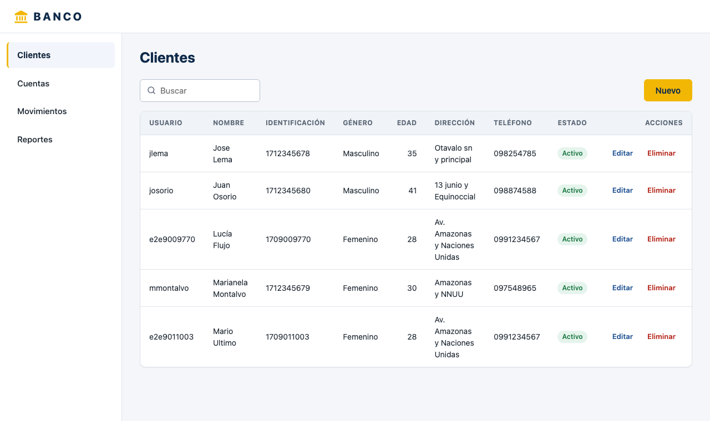
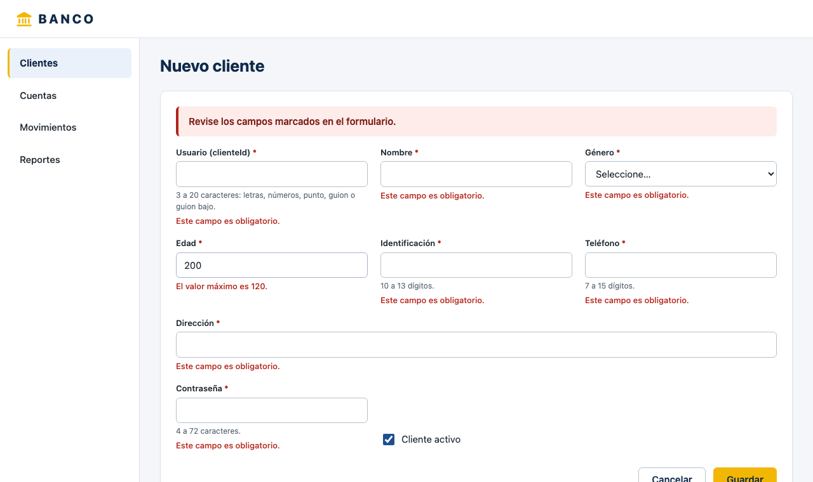
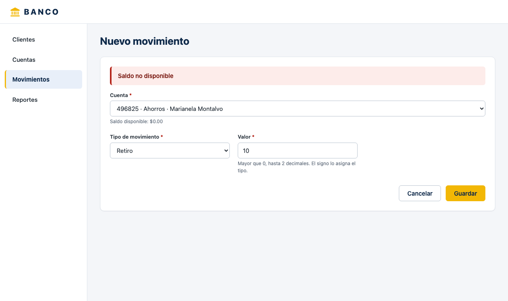
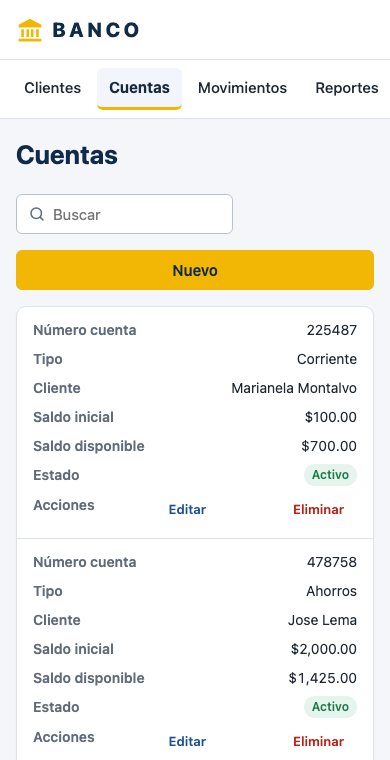

# Banco — Ejercicio técnico Full-Stack

API REST en **Java 25 + Spring Boot 4** y SPA en **Angular 21**, sobre **PostgreSQL 17**, desplegadas con **Docker**.
Gestión de clientes, cuentas y movimientos con reglas de saldo y cupo diario, y estado de cuenta en JSON y PDF (base64).



## Inicio rápido

Requisitos: Docker (Docker Desktop, o Colima + `docker-compose`).

```bash
docker compose up -d --build        # o: docker-compose up -d --build
```

| Servicio | URL |
|---|---|
| Frontend | http://localhost:4200 |
| API | http://localhost:8080/api |
| Swagger UI | http://localhost:8080/swagger-ui.html |
| PostgreSQL | `localhost:5433` (usuario/clave/base: `banco`) |

Puertos y credenciales se cambian copiando `.env.example` a `.env`.
Reiniciar con base vacía: `docker compose down -v && docker compose up -d`.

## Verificación

```bash
# Colección Postman (base vacía): 39 requests con asserts sobre los casos de uso
npx newman run postman/banco-api.postman_collection.json -e postman/banco-local.postman_environment.json
```

También se puede importar `postman/banco-api.postman_collection.json` en Postman y ejecutar la colección en orden.

## Desarrollo local

```bash
# Base de datos
docker compose up -d db

# Backend (Java 25)
cd backend
./mvnw spring-boot:run          # http://localhost:8080
./mvnw verify                   # tests unitarios, de endpoints, integración (Testcontainers), ArchUnit y cobertura

# Frontend (Node 24)
cd frontend
npm ci
npm start                       # http://localhost:4200, proxy /api → :8080
npm test                        # Jest
```

Con Colima, Testcontainers necesita:

```bash
export DOCKER_HOST=unix://$HOME/.colima/default/docker.sock
export TESTCONTAINERS_DOCKER_SOCKET_OVERRIDE=/var/run/docker.sock
```

## Estructura

```
backend/      API Spring Boot (por feature: cliente, cuenta, movimiento, reporte)
frontend/     SPA Angular (core, shared, features)
postman/      Colección y environment
docs/img/     Capturas
BaseDatos.sql Esquema + datos de los casos de uso 1 a 3
```

## Arquitectura

- **Backend por feature** (`cliente`, `cuenta`, `movimiento`, `reporte`), cada uno con capas `web → application → domain`; `infrastructure` para adaptadores (PDF).
- **Patrones:** Repository, Strategy (depósito/retiro), Factory, Port & Adapter, DTO, Specification.
- **Errores** con Problem Details (RFC 9457); reglas de negocio en 422, conflictos en 409.
- **Contrato de la API** navegable en Swagger UI (`/swagger-ui.html`).

## Reglas de negocio

- Crédito (`DEPOSITO`) se guarda positivo, débito (`RETIRO`) negativo; cada movimiento guarda el saldo resultante.
- Retiro sin saldo suficiente → `422 "Saldo no disponible"`.
- Retiros del día por cuenta mayores a 1000 → `422 "Cupo diario Excedido"` (configurable con `BANCO_LIMITE_DIARIO_RETIRO`).
- Solo el último movimiento de una cuenta se puede corregir o eliminar (preserva la cadena de saldos).
- No se elimina un cliente con cuentas ni una cuenta con movimientos (`409`).
- Movimientos concurrentes sobre la misma cuenta se serializan (bloqueo pesimista).

## Capturas

| | |
|---|---|
|  |  |
|  |  |
